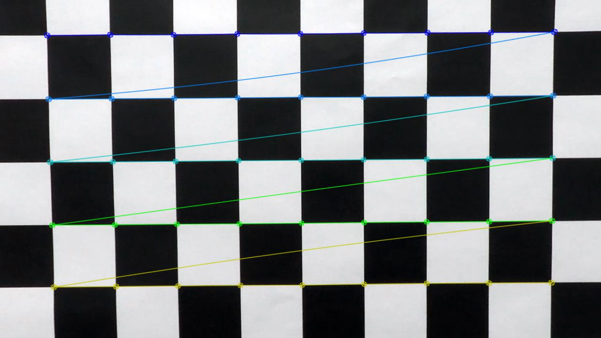
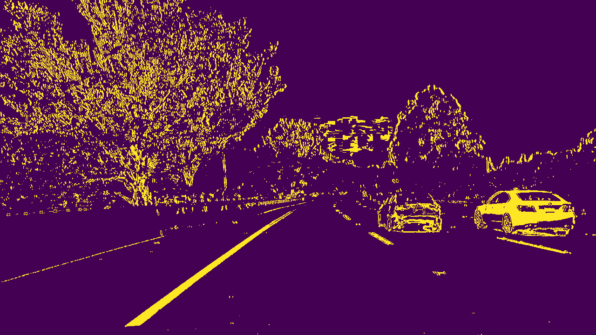
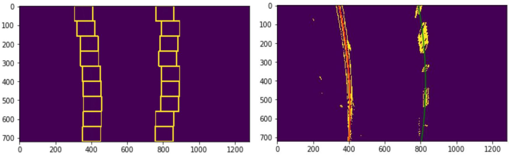
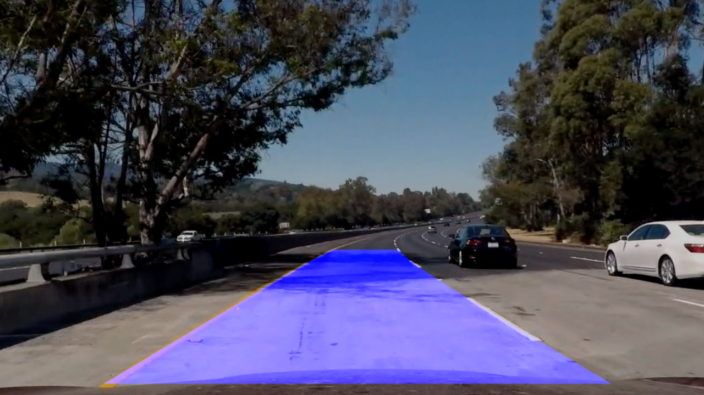

# CARND-Advanced-lane-finding

Camera calibration

Camera needs to be calibrated to fix the distortions present in the images it captures. Typically several pictures of a chess board are taken from different angles by the camera and then following steps are followed: 
1. Manually count the number of visible corners in horizontal (nx) and vertical(ny) direction.
2. Convert the distorted color image to gray scale image and find corners using command cv2.findChessboardCorners()
3. The output of the command is an array of corner indices.
5. A mesh grid of dimension (nx , ny) is made to represent real world chess board points on a plane. The mesh grid points are then reshaped into 3-dimensional array.
6. Further calibration matrix and distortion matrices are is then obtained using command cv2.calibrateCamera. 
However, matrix and coefficients obtained from processing a single distorted image is not enough to remove other type of distortions in an image. Hence an augmented array is formed by stitching together the distortions matrices obtained from several distorted images of the chess board. 

Distorted Image
 

Calibrated Image
 

Binary images
After removing the distortions, binary image is obtained by performing union operation on images obtained by filtering the image through sobel operator, S Channel and V channel of the image. The thresholds are tuned to obtain maximum number of desired pixels of lanes while limiting the undesired pixels.

Binary Image = (Sobel operator X-axis) U (S Channel of HLS)  U (V channel of HSV)

Example of Combined binar

The combined binary image is then masked to remove undesired information from the image. Using cv2.HoughLinesP() command, lines are obtained in the masked image and then pixels corresponding to left and right lanes are separated based on the slope of the respective line.
A gradient range (0.4 to 1.7 or -1.7 to -0.4) is finalized to find pixel of respective lanes. Further threshold and other parameters are tuned to meet the requirements. 
Further perspective transformation is performed on the masked image by using cv2.warpPerspective() function to get the warped image
![](warped.JPG
Window search method
Next, sliding window method is implemented to search lane pixels inside a smaller window of dimensions 80 x 100 pixels. The search begins from the bottom of the image. Further the next window initiates immediately above the previous window and slides horizontally towards the mean of the pixels which fall inside the search window. This process goes on in a loop until all the rows of the image is searched and desired pixels of both left and right lanes are obtained.

Local Search method

Since the lane curvatures do not change much in subsequent frames, Localized search method is implemented by searching for the lane pixels in the vicinity of lane curve obtained in previous frame. To accomplish this task, global variables are used, and lane curvature coefficients are stored. 
Additionally, lane pixels from last frame are combined with lane pixels of current frame to obtain robust lane curvature. This ensures an efficient pixel search and lane curvature computation. In the project video test, the lane pixels are detected by localized search method in almost all of the frames except in very few detectable frames.

Improvement Area:
The pipeline fails to find lane pixels when the vehicle encounters bump or a jerk. Also, if pipeline is vulnerable to changes in lane surfaces, shadows, tire marks, black patches, It required lots of tuning of Hough lines parameters to get suitable pixels. Sometimes pixels are not easily obtained, and pipeline fails to find the lanes. As solution to these problems, I have two abstract thoughts. First, a filter can be designed which can identify anomalous and undesired pixel by comparing the last frame. Second, a dynamic mask can be designed which can change its shape according to the information received on lanes from last frame. Examples of pipe line failure:
